# VoiceUse Architecture Diagrams

This document maps the current VoiceUse architecture as implemented in the
codebase. The diagrams are intentionally split by concern so a future reader can
understand how voice input, LLM planning, local OS control, visual computer use,
plugins, and the Codex MCP adapter fit together without reading every module
first.

## 1. System Context

VoiceUse has two major ways to control the desktop:

- The local voice application started with `voiceuse`.
- The globally installed MCP server started with `voiceuse-computer-control-mcp`.

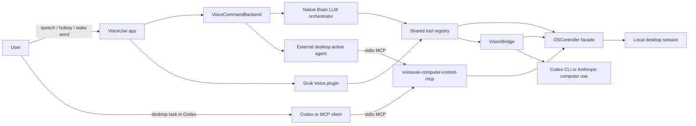

Key files:

- `voiceuse/main.py`
- `voiceuse/agent_backend.py`
- `voiceuse/brain.py`
- `voiceuse/tool_registry.py`
- `voiceuse/os_controller.py`
- `voiceuse/vision_bridge.py`
- `voiceuse/computer_control_mcp.py`

## 2. Voice Pipeline

This is the normal pipeline when no replacement realtime plugin is active.

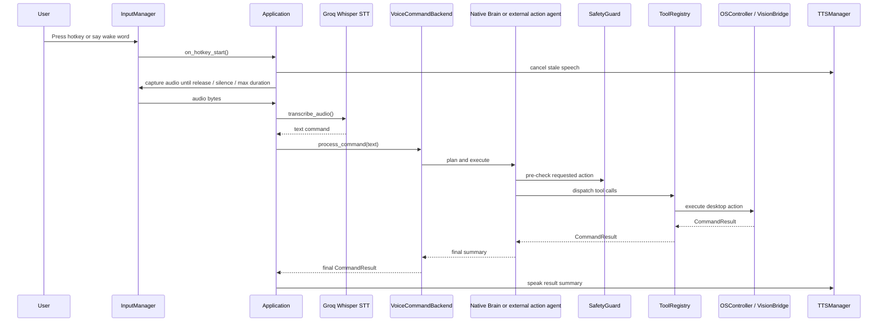

Important behavior:

- Audio and STT work is kept off the event loop where it can block.
- `TTSManager.cancel()` is called on new user input so old speech does not keep
  playing over a new command.
- `VoiceCommandBackend` decides whether the command goes to the native Brain or
  an external MCP-capable desktop action agent.

## 3. Application Composition Root

`Application` is the runtime owner for the default app. It wires dependencies
once, keeps references as instance attributes, and owns startup/shutdown.

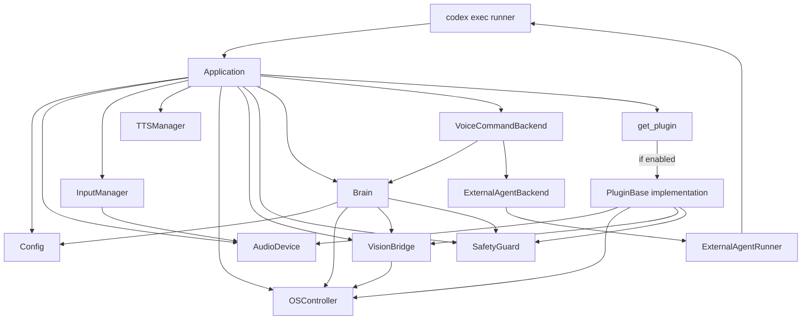

This is the most important lifecycle boundary. New subsystems should generally
be constructed here instead of inside unrelated modules.

## 4. Voice Front-End To External Agent Backend

This is the new bridge between the original voice assistant and the stronger
computer-use agent path. VoiceUse keeps the real-time voice UX. The external
agent owns the observe, reason, act, verify loop through the MCP tools.

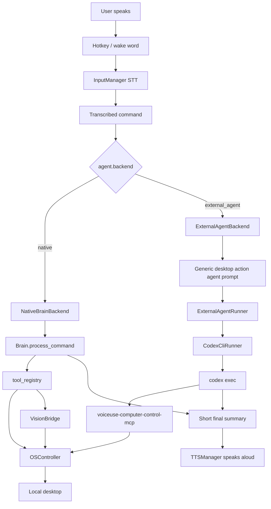

Config switch:

```yaml
agent:
  backend: external_agent
  runner: codex_cli
```

The prompt in `ExternalAgentBackend` does not mention Codex. It describes a
generic desktop action agent contract so another MCP-capable agent runner can be
added behind the same interface.

## 5. Application State Machine

VoiceUse has multiple asynchronous triggers. The state machine in `main.py`
keeps lifecycle transitions explicit.

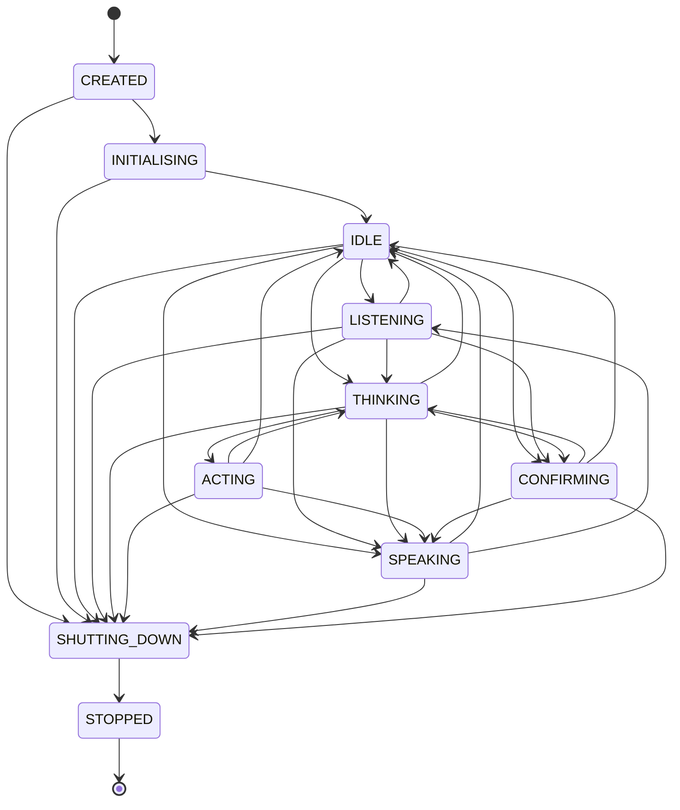

The state machine is intentionally coarse. It protects the application from
invalid high-level transitions; it does not model every low-level audio or tool
operation.

## 6. Brain Agent Loop

The Brain is the top-level LLM orchestrator for the default voice pipeline.
It owns conversation history, desktop context, provider fallback, safety checks,
tool dispatch, and result recording.

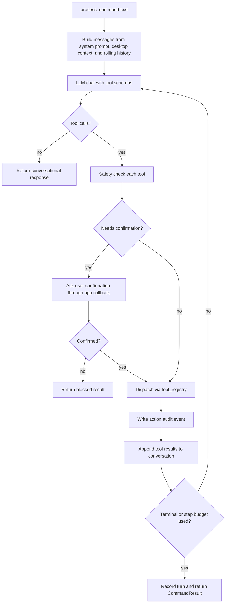

Key implementation details:

- `_LLMClient.chat()` retries transient provider failures and then falls back.
- Desktop context is cached briefly so repeated agent steps do not enumerate
  windows more than necessary.
- Tool results become context for later planning rounds in the same user command.

## 7. Shared Tool Dispatch

Both the default Brain and the Grok Voice plugin use the same tool schema and
dispatcher so their capabilities do not drift.

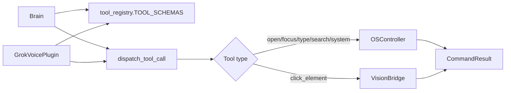

High-value files:

- `voiceuse/tool_registry.py`
- `voiceuse/models.py`
- `voiceuse/action_audit.py`

## 8. OS Control Facade And Focused Services

`OSController` is still the public facade, but it now delegates high-risk or
focused behavior into smaller services.

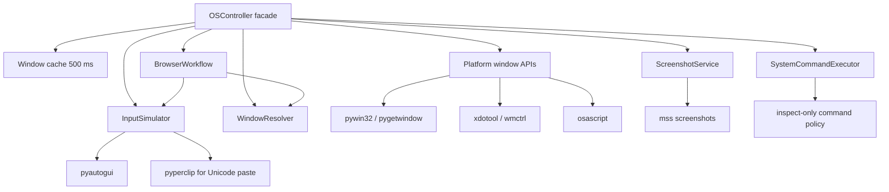

Architectural point:

- `OSController` remains the compatibility surface.
- New behavior should usually land in a focused service under
  `voiceuse/os_services.py` first, then be exposed by `OSController`.

## 9. Visual Computer-Use Loop

`VisionBridge.find_and_click()` is the closed-loop computer-use path for visual
UI tasks.

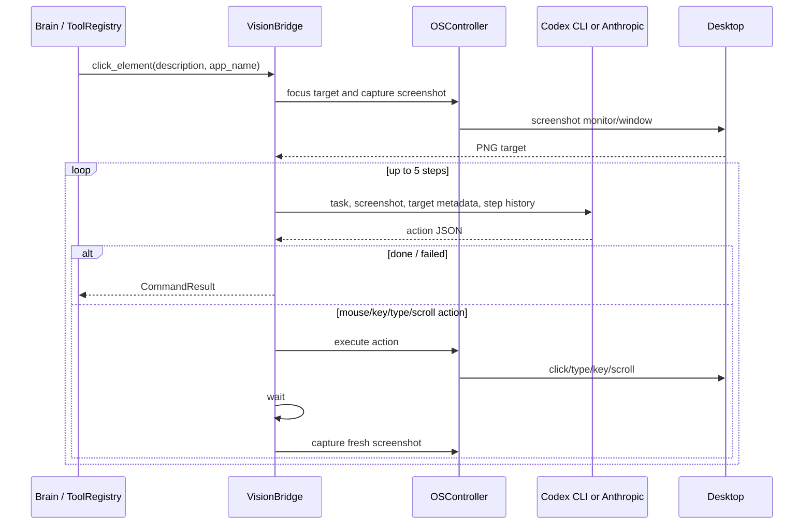

Why this exists:

- A single screenshot-and-click cannot recover from popups, loading delays,
  wrong focus, stale UI, or misclicks.
- The loop gives the model a chance to observe the result of each action and
  adapt before continuing.

## 10. Codex MCP / Plugin Architecture

Codex gets desktop-control tools through a globally registered MCP server. The
Codex plugin and skill provide a convenience layer and usage guidance.

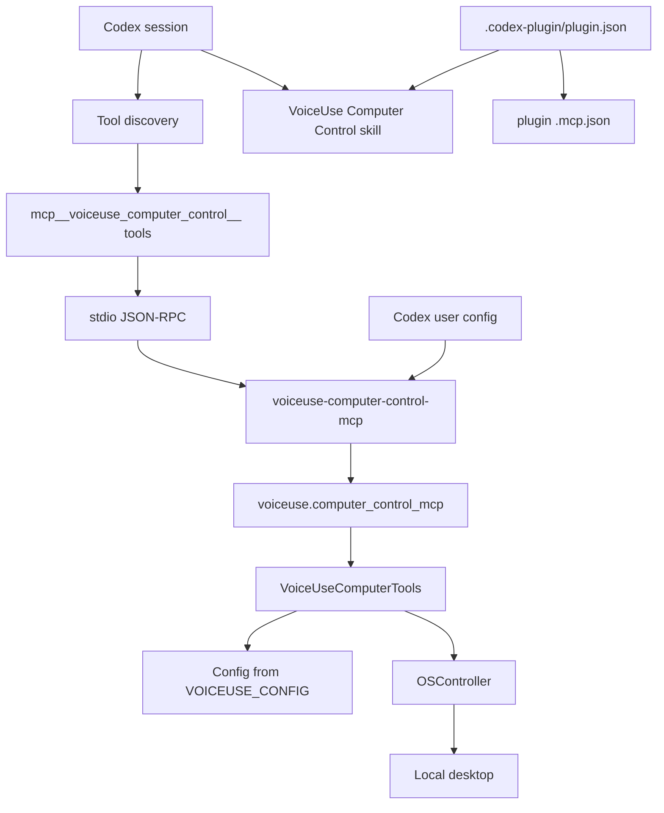

Important paths:

- MCP server module:
  - `D:\code\voice-computer-use-agent\voiceuse\computer_control_mcp.py`
- Global launcher:
  - `C:\Users\jfrie\bin\voiceuse-computer-control-mcp.cmd`
- Codex skill:
  - `D:\code\voice-computer-use-agent\plugins\voiceuse-computer-control\skills\voiceuse-computer-control\SKILL.md`
- Plugin manifest:
  - `D:\code\voice-computer-use-agent\plugins\voiceuse-computer-control\.codex-plugin\plugin.json`
- MCP declaration:
  - `D:\code\voice-computer-use-agent\plugins\voiceuse-computer-control\.mcp.json`

## 11. MCP Tool Call Lifecycle

This is what happens when Codex calls a loaded VoiceUse MCP tool.

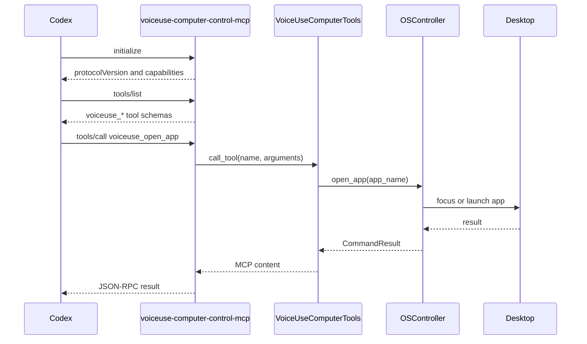

The direct MCP registration is intentionally independent of the plugin cache.
That makes the tool server globally available from any Codex working directory
as long as the launcher remains on PATH.

## 12. Grok Voice Realtime Plugin

The Grok plugin is a replacement pipeline. It does not use the default
InputManager, Brain, or TTSManager as the active voice loop. It still shares the
same OS, vision, safety, audit, audio-device, and tool-dispatch layers.

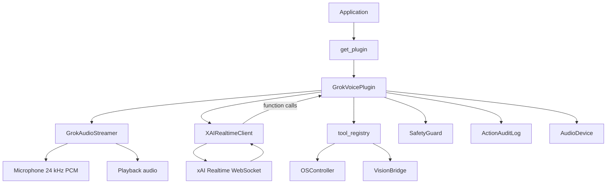

The main architectural weakness that remains is that this plugin is still a
replacement mode rather than a fully compositional audio pipeline. The good part
is that tool schemas and dispatch are now shared, so desktop-control behavior is
not duplicated.

## 13. Safety, Permissions, And Audit Path

Safety is not only a prompt concern. The code has explicit checks before tool
execution and audit records after attempted actions.

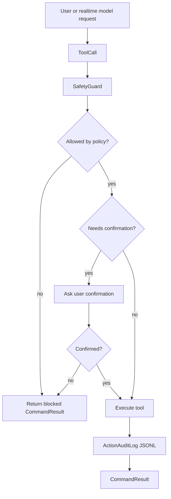

Main files:

- `voiceuse/safety.py`
- `voiceuse/action_audit.py`
- `voiceuse/tool_registry.py`

## 14. Observability Flow

Latency timing is deliberately close to the paths that users feel: end-to-end
pipeline time and tool dispatch time.

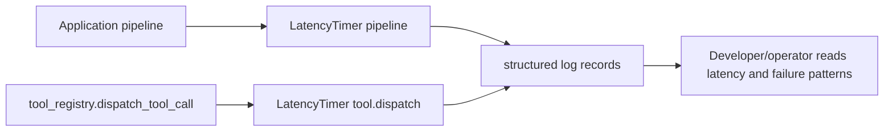

This is still lightweight observability. A production version should add
durable metrics for STT duration, LLM provider latency, token usage, TTS
duration, tool failure rates, and confirmation frequency.

## 15. Configuration And Secrets

Configuration is loaded from YAML with environment-variable resolution.
Serialized config intentionally excludes resolved secrets.

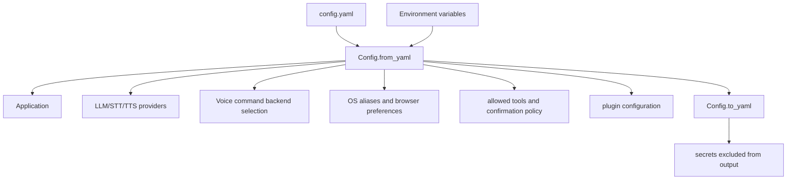

Common environment variables:

- `GROQ_API_KEY`
- `OPENAI_API_KEY`
- `CEREBRAS_API_KEY`
- `ANTHROPIC_API_KEY`
- `XAI_API_KEY`
- `PORCUPINE_ACCESS_KEY`

## 16. Current Architectural Boundaries

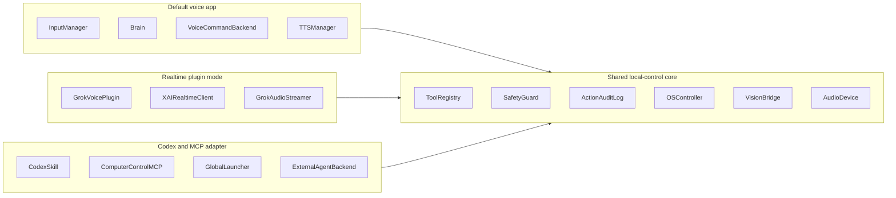

The long-term target architecture should keep moving code into `SharedCore`.
Voice, realtime plugins, and external MCP clients should become different
front-ends over the same local-control engine rather than parallel
implementations.
