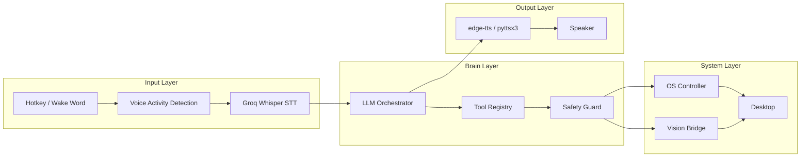
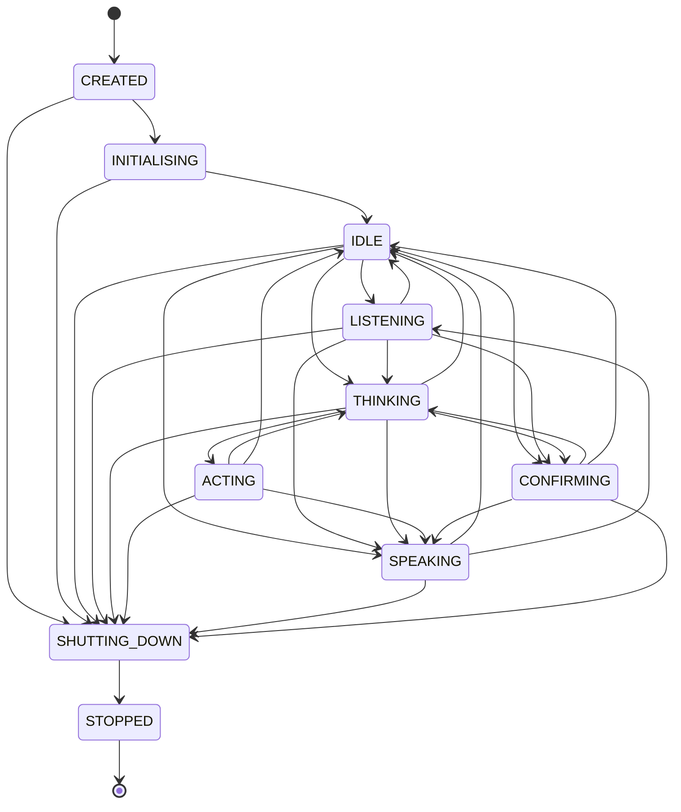
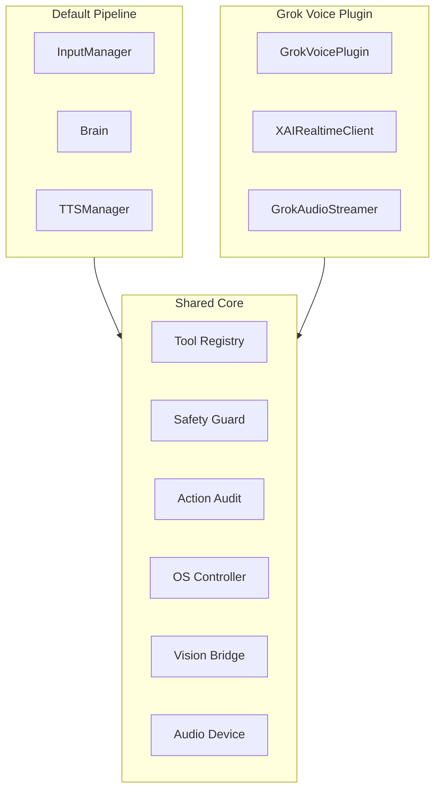

# Architecture

VoiceUse is built around a modular pipeline architecture with clear separation between voice input, LLM reasoning, system control, and output.

## System Overview



## Pipeline Flow

1. **Input** — User activates via hotkey or wake word. Audio is captured until release/silence.
2. **STT** — Groq Whisper transcribes speech to text asynchronously.
3. **Reasoning** — LLM plans actions using tool schemas, desktop context, and conversation history.
4. **Safety** — Destructive actions trigger spoken confirmation.
5. **Execution** — Tools dispatch to OS Controller or Vision Bridge.
6. **Response** — TTS speaks the result summary.

## Core Components

### InputManager

Handles all user input activation:

- **pynput** hotkeys (hold Right Ctrl)
- **Porcupine** wake word detection ("Computer")
- **webrtcvad** voice activity detection
- **Groq Whisper** speech-to-text transcription

Runs audio work off the main async loop to prevent blocking.

### Brain

The LLM orchestrator that:

- Builds messages from system prompt, desktop context, and history
- Calls LLM with tool schemas
- Handles provider fallback (Groq → OpenAI → Cerebras)
- Manages conversation history
- Applies safety checks before tool dispatch
- Records action audit events

### Tool Registry

Shared tool schemas and dispatch used by both Brain and plugins:

| Tool | Purpose |
|------|---------|
| `open_app` | Launch or focus applications |
| `focus_window` | Bring window to front |
| `type_text` | Simulate keyboard input |
| `press_key` | Press specific keys |
| `click_element` | Vision-based UI clicking |
| `take_screenshot` | Capture screen/window |
| `run_system_command` | Execute shell commands |
| `open_url` | Open URLs in browser |
| `search_web` | Web search |

### OSController

Cross-platform desktop control facade:

- **Window management** — pywin32 (Windows), xdotool (Linux), AppleScript (macOS)
- **Input simulation** — pyautogui for mouse/keyboard
- **Screenshots** — MSS for multi-monitor capture
- **System commands** — Allow-listed shell execution

### VisionBridge

Closed-loop computer vision for UI interaction:

1. Capture screenshot of target window/monitor
2. Send to vision provider (Codex CLI or Anthropic)
3. Receive action JSON (click coordinates, key presses)
4. Execute action via OSController
5. Re-capture screenshot and repeat up to 5 steps

This handles popups, loading delays, and misclicks through observation.

### TTSManager

Multi-backend text-to-speech with playback queue:

- **Primary:** edge-tts (online, high quality)
- **Fallback:** pyttsx3 (offline, system voices)
- **Playback:** ffplay, mpv, or platform-native players
- **Cancellation:** New user input cancels stale speech

## State Machine

The Application maintains explicit state transitions:



States protect against invalid transitions (e.g., can't start listening while already thinking).

## MCP Integration

VoiceUse exposes desktop control tools via MCP (Model Context Protocol):

```bash
# Register with Codex CLI
codex mcp add voiceuse-computer-control -- voiceuse-computer-control-mcp
```

This enables Codex and other MCP-capable agents to control the desktop through VoiceUse's OS layer.

## Plugin Architecture

Plugins replace the default pipeline while sharing core services:



The Grok Voice plugin demonstrates this: it replaces STT→Brain→TTS with a single xAI Realtime WebSocket while using the same tools, safety, and OS layers.
