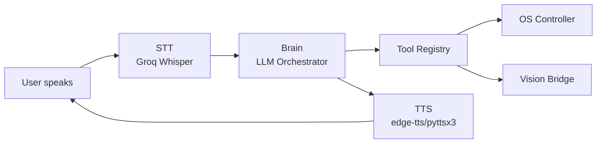

# Getting Started

VoiceUse is a **local desktop voice agent** that controls your computer hands-free. Speak commands, and VoiceUse will transcribe, plan, execute, and respond — all running natively on your machine.

## What VoiceUse Can Do

- **Control windows** — open, focus, minimize, resize, and move applications
- **Type text** — dictation into any text field
- **Click UI elements** — describe what you want to click in natural language
- **Take screenshots** — capture full screens or specific windows
- **Execute system commands** — run shell commands through an allow-list
- **Browse the web** — open URLs and navigate pages

## Quick Start

### 1. Install

=== "pipx (Recommended)"

    ```bash
    pipx install "voice-computer-use-agent[all]"
    ```

=== "uv"

    ```bash
    uv tool install "voice-computer-use-agent[all]"
    ```

=== "pip"

    ```bash
    pip install "voice-computer-use-agent[all]"
    ```

### 2. Set API Keys

```bash
export GROQ_API_KEY="gsk_..."
export OPENAI_API_KEY="sk-..."      # optional fallback
export ANTHROPIC_API_KEY="sk-ant-..." # optional vision
```

### 3. Run

```bash
voiceuse
```

Hold ++right-ctrl++ and speak, then release to submit. Or say **"Computer"** if wake word is enabled.

## System Requirements

| Requirement | Details |
|-------------|---------|
| Python | 3.10 or higher |
| OS | Windows (primary), Linux, macOS (best-effort) |
| Microphone | Required for voice input |
| API Keys | Groq required; OpenAI/Anthropic optional |

## Architecture Overview

VoiceUse follows a modular pipeline architecture:



Learn more in the [Architecture](architecture.md) section.

## Next Steps

- [Installation Guide](installation.md) — Detailed platform-specific setup
- [Configuration](configuration.md) — Customize behavior with `config.yaml`
- [Usage](usage.md) — Learn how to use VoiceUse effectively
- [Plugins](plugins.md) — Extend with custom providers
