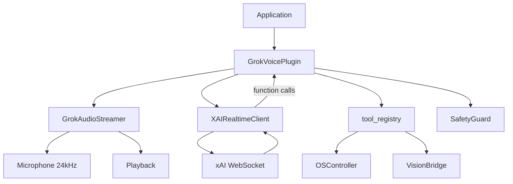

# Plugins

VoiceUse uses a **replace-mode plugin architecture**. When a plugin is enabled, it fully replaces the default Brain + InputManager STT + TTSManager pipeline. Plugins share the same OS control, vision, safety, and audit layers.

## Grok Voice Plugin

The Grok Voice plugin uses the **xAI Realtime API** to stream audio end-to-end (STT + LLM + TTS in one WebSocket connection).

### Why Use Grok Voice?

- **Ultra-low latency** — Single WebSocket eliminates round-trips between STT→LLM→TTS
- **Natural interruptions** — Server-side VAD with interruption support
- **Voice personalities** — Multiple assistant voices to choose from
- **24 kHz audio** — Higher quality audio streaming

### Enabling the Plugin

1. Set your xAI API key:

    ```bash
    export XAI_API_KEY="xai-..."
    ```

2. Edit `config.yaml`:

    ```yaml
    plugins:
      grok_voice:
        enabled: true
        api_key: null          # uses XAI_API_KEY env var
        model: grok-voice-think-fast-1.0
        voice: Eve             # Eve, Ara, Leo, Rex, Sal
        instructions: "You are a desktop voice assistant..."
        sample_rate: 24000
        turn_detection_type: server_vad
        input_audio_transcription_model: grok-2-audio
    ```

3. Run VoiceUse normally:

    ```bash
    voiceuse
    ```

### Available Voices

| Voice | Personality |
|-------|-------------|
| `Eve` | Warm, conversational |
| `Ara` | Professional, concise |
| `Leo` | Energetic, enthusiastic |
| `Rex` | Direct, no-nonsense |
| `Sal` | Friendly, casual |

### Plugin Architecture



## Provider Swapping

Even without plugins, you can swap individual providers:

### STT Providers

| Provider | Model | Notes |
|----------|-------|-------|
| `groq` | `whisper-large-v3` | Default, fast, accurate |

### LLM Providers

| Provider | Models | Use Case |
|----------|--------|----------|
| `groq` | `llama-3.3-70b-versatile` | Default, fast inference |
| `openai` | `gpt-4o`, `gpt-4o-mini` | Reliable fallback |
| `cerebras` | `llama-3.1-70b` | Alternative fast inference |

### TTS Providers

| Provider | Voices | Notes |
|----------|--------|-------|
| `edge` | `en-US-AriaNeural` | Default, online, high quality |
| `pyttsx3` | System voices | Offline fallback |

### Vision Providers

| Provider | Auth | Notes |
|----------|------|-------|
| `codex` | OAuth via `codex login` | Default, no API key needed |
| `anthropic` | `ANTHROPIC_API_KEY` | Alternative provider |

## Creating a Custom Plugin

To add a new plugin:

1. Create a directory under `voiceuse/plugins/<my_plugin>/`
2. Implement `PluginBase` in `plugin.py`
3. Register in `voiceuse/plugins/__init__.py`
4. Add config section in `voiceuse/config.py`
5. Write tests in `tests/test_my_plugin.py`

### Plugin Interface

Plugins must implement the `PluginBase` abstract class:

```python
from voiceuse.plugins.base import PluginBase

class MyPlugin(PluginBase):
    async def start(self):
        """Initialize and begin the plugin loop."""
        pass
    
    async def stop(self):
        """Gracefully shutdown."""
        pass
```

### Thread → Async Bridge

Background threads (hotkeys, wake word) must use `asyncio.run_coroutine_threadsafe()` to schedule async callbacks:

```python
import asyncio

async def on_hotkey():
    await self.handle_activation()

# From a background thread
asyncio.run_coroutine_threadsafe(on_hotkey(), self.loop)
```

### Safety Integration

All plugins must apply `SafetyGuard.check_command()` before dispatching tool calls:

```python
from voiceuse.safety import SafetyGuard

result = self.safety.check_command(tool_name, arguments)
if not result.allowed:
    return CommandResult.error(result.reason)
```
