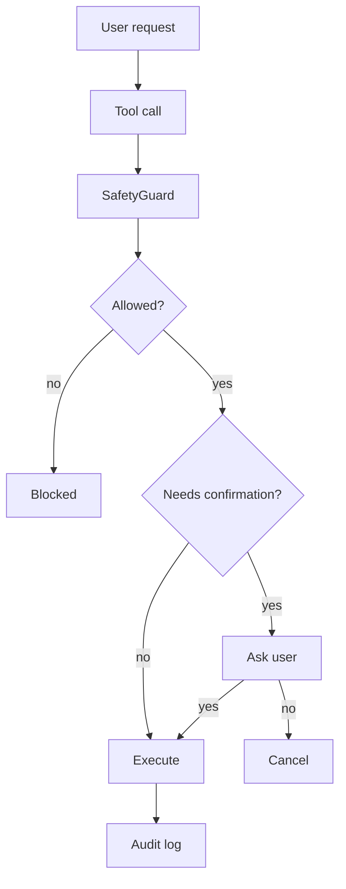

# Safety & Security

VoiceUse implements multiple layers of safety to protect your system from accidental or malicious voice commands.

## Spoken Confirmation

Before any destructive action, VoiceUse:

1. **Speaks a confirmation prompt** — e.g., "You asked me to close the window. Should I proceed?"
2. **Listens for your response** — Waits for spoken confirmation
3. **Acts on your answer**:
   - **Proceeds** on: `yes`, `yep`, `yeah`, `sure`
   - **Cancels** on: `no`, `nope`, `cancel`, timeout (10s), or any other response



## Destructive Keyword Detection

The following keywords trigger confirmation:

```yaml
safety:
  destructive_keywords:
    - close
    - quit
    - delete
    - remove
    - kill
    - terminate
    - shutdown
    - reboot
    - format
    - rm -rf
    - type password
    - enter password
    - input password
```

You can customize this list in your `config.yaml`.

## Shell Command Allow-List

System commands run through an allow-list by default. Unknown commands are **blocked** with an error message.

!!! danger "Default Policy"
    By default, `shell=False` is used. Commands not in the allow-list are rejected. This prevents accidental execution of dangerous commands.

## Audit Logging

Every tool call is logged to an audit trail:

```python
# Logged automatically
tool_name: "open_app"
arguments: {"app_name": "Chrome"}
result: "success"
timestamp: "2024-01-15T10:30:00Z"
```

Audit logs help you review what VoiceUse did and debug issues.

## Password Protection

VoiceUse explicitly detects password entry attempts:

- `"type password"`
- `"enter password"`
- `"input password"`

These always trigger confirmation and are logged.

## Best Practices

1. **Review your config** — Check `destructive_keywords` matches your workflow
2. **Start with `--dry-run`** — Test without API calls first
3. **Monitor audit logs** — Regularly check what actions were taken
4. **Use aliases** — Prevent STT errors from resolving to dangerous app names
5. **Keep API keys secure** — Use environment variables, never commit keys

## Reporting Security Issues

If you discover a security vulnerability, please open an issue on GitHub or contact the maintainers directly.
